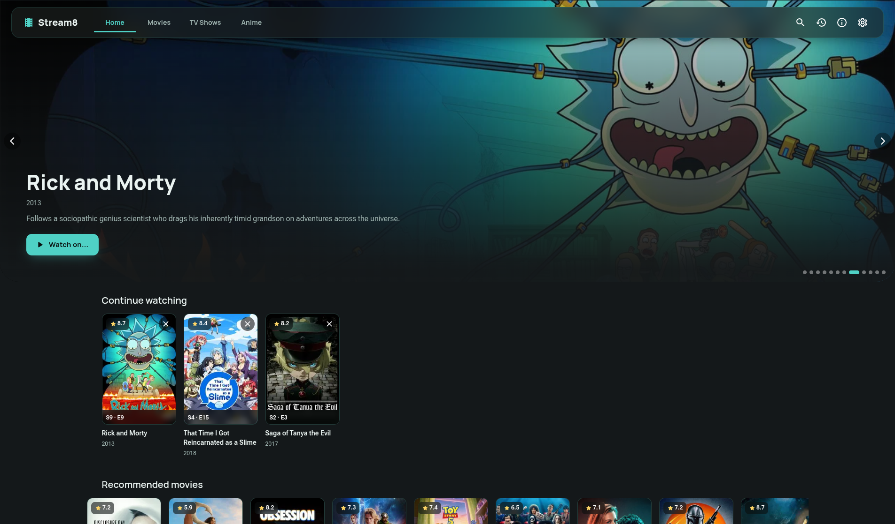
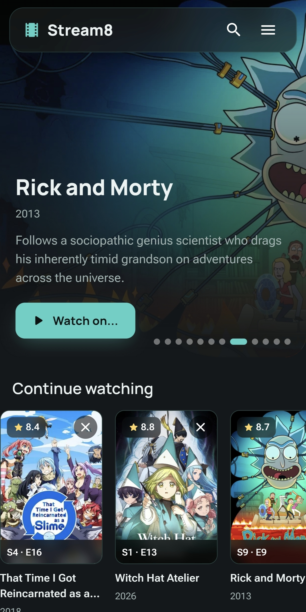

# 🎬 Stream8

<p align="center">
  
</p>

**Stream8** is a modern and responsive Progressive Web App (PWA) designed to track and stream your favorite movies, TV shows, and anime. It seamlessly integrates with **The Movie Database (TMDB)** and **AniList** APIs, and syncs in real-time with [Stream8 Sync Server](https://github.com/rizzonicola/stream8-sync).

🌐 **Live Application:** [https://stream8.poppi.cc](https://stream8.poppi.cc)

---

## ✨ Features

* **Comprehensive Catalog:** Search and discover Movies, TV Shows, and Anime via TMDB and AniList APIs.
* **PWA Support:** Installable on desktop and mobile devices as a native-like application.
* **Cross-Device Sync:** Native integration with the self-hosted [Stream8 Sync Server](https://github.com/rizzonicola/stream8-sync) to sync watch history and playback progress across devices.
* **Custom Sources & Streaming:** Advanced setup for external streaming providers and JSON configurations.

---

## 📸 Screenshots

| Desktop View | Mobile View |
| :---: | :---: |
|  |  |

---

## 🔑 TMDB Configuration

Before running the application locally, insert your **The Movie Database (TMDB)** Bearer Token into `src/api/tmdb.js`:

```javascript
const TMDB_TOKEN = "YOUR_TMDB_TOKEN";

```
## 🛠️ Getting Started
### Prerequisites
 * Node.js (v18 or higher)
 * npm or yarn
### Installation
```bash
# 1. Install dependencies
npm install

# 2. Run the development server
npm run dev

```
## 📄 License
Distributed under the **GNU General Public License v3.0 (GPLv3)**. See LICENSE for more information.
